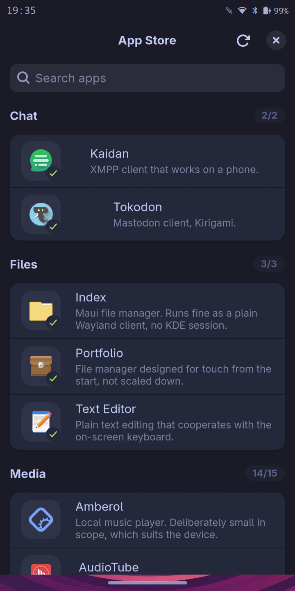
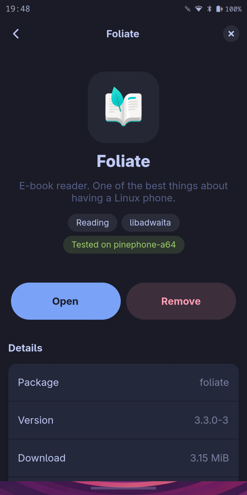

# moarchy-store

A curated store of Linux phone apps that **actually fit a small screen**.

<p align="center">
  
  
</p>

<p align="center"><em>Shot on a PinePhone at 360×720. The palette is not the
app's own — it is read from the active Omarchy theme, here tokyo-night.</em></p>

`pacman -Ss` already lists every package. What it cannot tell you is which of
them survive 360×720 logical pixels and 2 GB of RAM. That judgement is the whole
point of this app.

Built for [mobileomarchy](https://github.com/SimonSchubert/mobileomarchy) on a
PinePhone, but nothing in it is specific to that: it is useful on Phosh, Plasma
Mobile, postmarketOS, or any Arch-based phone.

## What it does

- Browse curated apps by category, with a note on *why* each one works
- See installed state, version and download size, read live from the system
- Install, open and remove, from the app, by touch
- Marks which entries were verified on real hardware and which are suggestions
- Takes its palette from the active Omarchy theme, so it matches the shell
  around it rather than shipping a look of its own

Apps are grouped by the toolkit that makes them adaptive — **libadwaita** (GNOME)
and **Kirigami** (Plasma Mobile) are the two families designed for phone widths.
Kirigami apps run fine as ordinary Wayland clients; no KDE session needed.

## Two kinds of app, one list

An entry is either a **package** from the Arch repos or an **Omarchy shell
plugin** — a git repo of QML that `omarchy-shell` loads into its own process.
They sit in the same categories, answer the same search and use the same detail
page, because someone looking for a notes app does not care which mechanism
delivers it.

Installing a plugin does three things: `omarchy plugin add` clones and validates
it, `omarchy plugin enable` loads it, and the store writes a `.desktop` entry so
it appears in the app drawer. That last step is what the word *app* is doing
here — the drawer lists desktop entries, not plugins, so without one a plugin
can only be opened from a keybinding, which is no use on a device with no
keyboard.

Two things are worth knowing before installing one:

- **A plugin runs unsandboxed inside your shell.** It needs no password because
  it needs no privilege — it can already do anything you can. The detail page
  says so above the button, because the store passes `--yes` to the command that
  would otherwise have asked.
- **Most of the marketplace cannot work here, and that is our bar's fault.**
  2087 of the 2410 plugins listed on plugins.omarchy.org are bar widgets, and
  mobileomarchy replaces Omarchy's widget-hosting bar with one sized for 360px
  that hosts none. Of the rest, most import `Quickshell.Hyprland` or call
  `hyprctl`, and this runs on Sway. `catalogue.toml` records the sweep.

## Install

```bash
yay -S moarchy-store-git
```

## The catalogue is the allowlist

Installing packages needs root, which is a genuine privilege surface. The design:

- The polkit action does **not** point at pacman. It points at
  `/usr/lib/moarchy-store/moarchy-store-helper`.
- The helper refuses any package not named in
  `/usr/share/moarchy-store/catalogue.toml`, and refuses to run at all if that
  file is not root-owned and non-world-writable.
- Package names are validated against `^[a-z0-9][a-z0-9@._+-]*$` before use, and
  pacman is exec'd with an argument list — never a shell.

So authenticating grants *"install one of these curated apps"*, not *"install
anything"*. If the action pointed at pacman directly, one authentication would
let a user install a package with a setuid binary or an install hook — a
straightforward local privilege escalation.

The consequence, deliberately accepted: **adding an installable app requires a
package update**, because it means editing a root-owned file. A catalogue
fetched over the network could not be trusted as an allowlist.

Plugins are outside all of this, and it is worth being exact about why. They
install into your own `~/.config/omarchy/plugins`, need no privilege, and never
reach the helper — so the helper's allowlist deliberately excludes them, and a
plugin id like `shell.settings` is a legal package name that must never leak
into it. What the catalogue gives a plugin is **curation, not a boundary**: it
fixes the git URL the store will clone, and the store checks that the cloned
repo declares the id the catalogue named before enabling it. Nothing stops you
running `omarchy plugin add` yourself, and nothing here pretends otherwise.

## Adding an app

Send a PR editing `catalogue.toml`:

```toml
[[app]]
pkg      = "foliate"
name     = "Foliate"
category = "Reading"
toolkit  = "libadwaita"   # libadwaita | kirigami | gtk | qt | tui
summary  = "E-book reader. One of the best things about having a Linux phone."
tested   = "pinephone-a64"   # or "" if you have not run it on a device
```

A shell plugin instead:

```toml
[[app]]
source   = "plugin"
id       = "yordanbuilds.jot"           # must match the repo's manifest.json
repo     = "https://github.com/yordanbuilds/jot.git"
name     = "Jot"
category = "Notes"
toolkit  = "quickshell"
summary  = "Quick capture: one thought, appended to an inbox file."
icon     = "document-new-symbolic"      # generic: plugins ship no icon theme
tested   = ""
```

`tested` is not decoration. An empty value renders as *"Not yet tested on a
device"* — a suggestion. A device string is a claim someone can hold you to.

For a plugin, three more things have to be true before it is worth proposing:

1. Its manifest `kinds` must include `overlay`, `panel` or `menu` — a bar widget
   has nowhere to draw, a bare service has nothing to open.
2. It must not import `Quickshell.Hyprland`, or shell out to `hyprctl` for
   anything beyond `decoration:rounding` and `general:gaps_out`, the only two
   options mobileomarchy's shim answers.
3. **If it takes text, it must take it through a real `TextInput`, `TextField`
   or `TextEdit`.** A plugin that catches raw keys with `Keys.onPressed` and
   assembles the string itself never requests text input, so the on-screen
   keyboard has nothing to respond to and never rises. That plugin is unusable
   here no matter how well it draws — which is not a thing any static check
   catches, and is why `tested` exists.

There is a fourth thing worth checking on hardware, still open: every plugin
here sits on `WlrLayer.Overlay`, while the keyboard sits on `Top`. An Overlay
surface draws over the keyboard, and a full-screen scrim will swallow the taps
meant for it. `mobileomarchy.drawer` avoids this by living on `Top` and
reserving space for the keyboard instead.

## Requirements

`python`, `python-gobject`, `gtk4`, `libadwaita`, `polkit`, `pacman` — all of
which a GNOME-adjacent phone image already has. Plugin entries additionally need
the `omarchy` CLI on `PATH`; without it those rows still browse, and only the
install button reports it is missing.

## License

MIT
